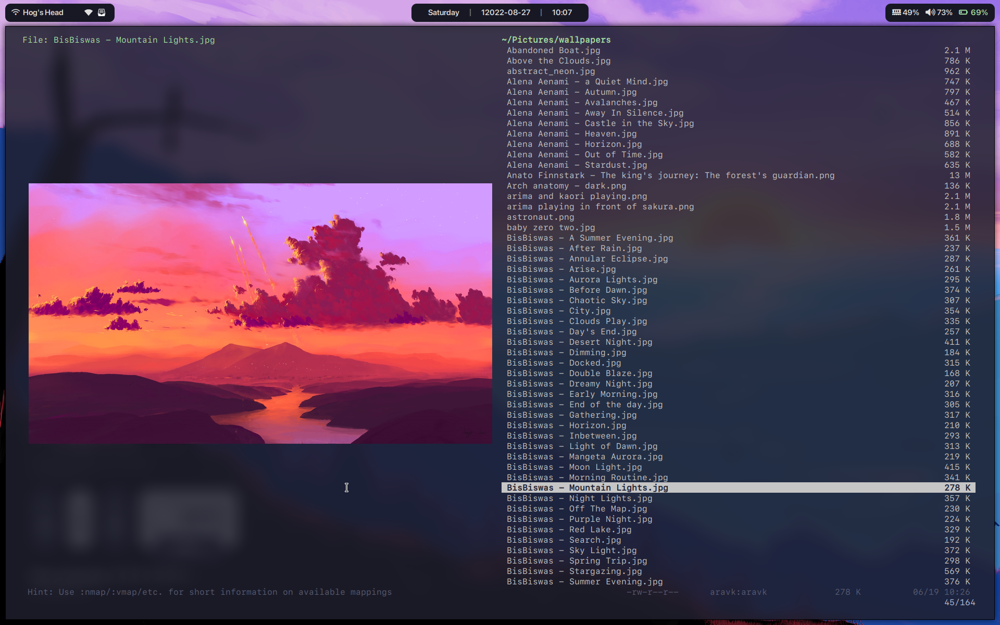

# dotfiles
The dotfiles for my Linux setup

+ WM: [bspwm](https://github.com/baskerville/bspwm)

+ OS: [Arch Linux](https://www.archlinux.org)

+ Shell: [fish](https://fishshell.com)

+ Status Bar: [Polybar](https://github.com/jaagr/polybar)

+ Lock Screen: [XSecureLock](https://github.com/google/xsecurelock)

+ Compositor: [Picom](https://github.com/yshui/picom)

+ Terminal: [Alacritty](https://github.com/alacritty/alacritty)

+ Text Editor: [Neovim](https://neovim.io)

+ File Manager: [Vifm](https://vifm.info/)

## Notes
I have [vifm-colors](https://github.com/vifm/vifm-colors/) and
[vifm_devicons](https://github.com/cirala/vifm_devicons) cloned into the vifm
directory, and the code for image previews in vifm is largely from
[vifmimg](https://github.com/cirala/vifmimg), with some tweaks by me so that the
previews are center-aligned.

I have cronjobs that call `notify_battery.sh` every minute and `.fehbg` every 20 minutes.

`notify-mpd.py` is started by `bspwmrc` whenever bspwm is loaded, and should take
care of MPD notifications.

**IMPORTANT:** This config is not meant to be something you can install and use out of the box. It's more like
something you can use as a reference.

## Screenshots

