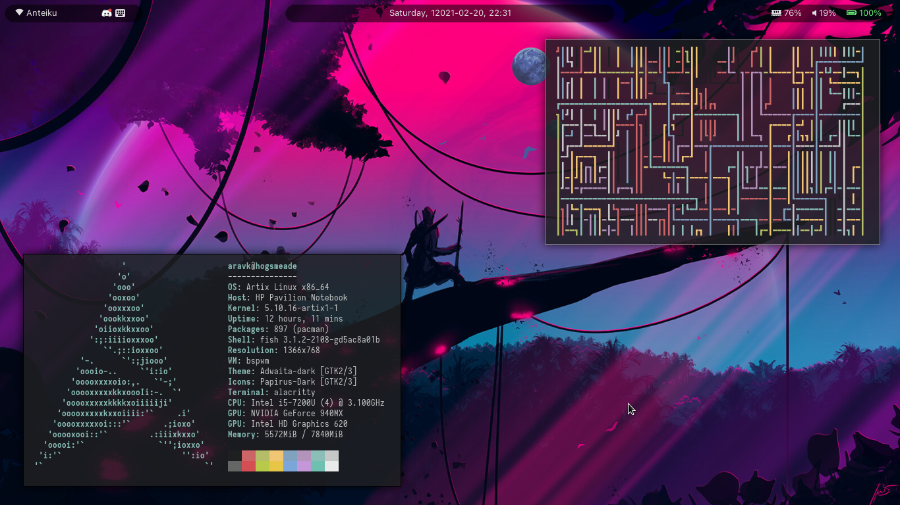

# dotfiles
The dotfiles for my Linux setup

+ WM: [bspwm](https://github.com/baskerville/bspwm)

+ OS: [Arch Linux](https://www.archlinux.org/)

+ Status Bar: [Polybar](https://github.com/jaagr/polybar)

+ Menu: [Rofi](https://github.com/davatorium/rofi)

+ Lock Screen: [xsecurelock](https://github.com/google/xsecurelock)

+ Compositor: [Picom](https://github.com/yshui/picom)

+ Terminal: [Alacritty](https://github.com/alacritty/alacritty)

+ File Manager: [vifm](https://github.com/vifm/vifm)

## Notes
I have [vifm-colors](https://github.com/vifm/vifm-colors/) and
[vifm_devicons](https://github.com/cirala/vifm_devicons) cloned into the vifm
directory, and the code for image previews in vifm is largely from
[vifmimg](https://github.com/cirala/vifmimg), with some tweaks by me so that the
previews are center-aligned.

I have cronjobs that call `notify_battery.sh` every minute, and `.fehbg` and
`notify_break.sh` every 20 minutes.

`notify-mpd.py` is started by `bspwmrc` whenever bspwm is loaded, and should take
care of MPD notifications. However, I also made another script called
`notify-ncmpcpp.py` that is called by ncmpcpp when the song changes (as long as
ncmpcpp itself is running), so `notify-mpd.py` will only send notifications if
ncmpcpp isn't running. Technically just `notify-mpd.py` without this is enough for
notifications, but I figured ncmpcpp might send out calls with more precise timings,
so I can make use of it as long as it's running.

There are some useful functions defined in `.zshrc`:
+ `lscolors`: print all the available color codes in their colors
+ `paste`: quick way to paste text to [paste.rs](https://paste.rs)

  Examples: `paste file.txt`, `echo "Hello, world" | paste`

There are also some Harry Potter spells defined as aliases in `.zshrc`, inspired from
reddit.
+ lumos: `exa -hlG --icons --git`
+ reducto: `rm`
+ aparecium: `bat`
+ accio: `yay`

## Screenshots

